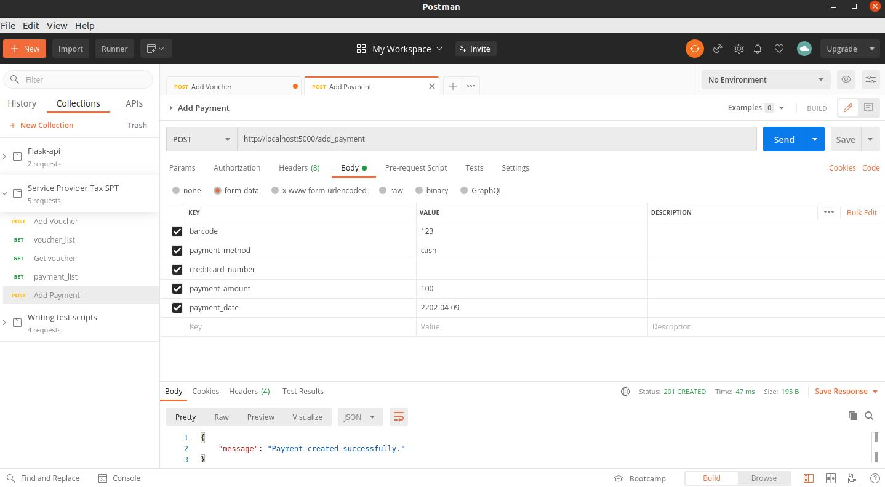

# Tax Service Provider  TSP
API REST 

# Description
Tax payment company has two very important functions:
Enable service provider companies to upload bills ("create-tax"). To effect the payment of a tax ("pay-tax").


## Installing

After cloning, create a virtual environment and install the requirements

```
$ virtualenv flaskapi
$ source flaskapi/bin/activate
$ cd /api
(flaskapi) $ pip3 install -r requirements.txt
```

* Create database
```
Flask db_create
```

* Delete database
```
Flask db_drop
```

* Insert default values to DB
```
Flask db_seed
```
## Getting Started

**Step 1:** Run the service api in /api
```
flask run
```

**Step 2:** Add Vouchers


**Step 2:** Add Payments



**Step 2:** List Vouchers


**Step 2:** List Payments


## Stack
* [Flask](https://flask.palletsprojects.com/en/1.1.x/quickstart/) - Lightweight WSGI web application framework
* [Python](https://www.python.org/) - Programming language
* [Pip3](https://pip.pypa.io/en/stable/) - Package and dependency manager
* [SQLite](https://www.sqlite.org) - Database